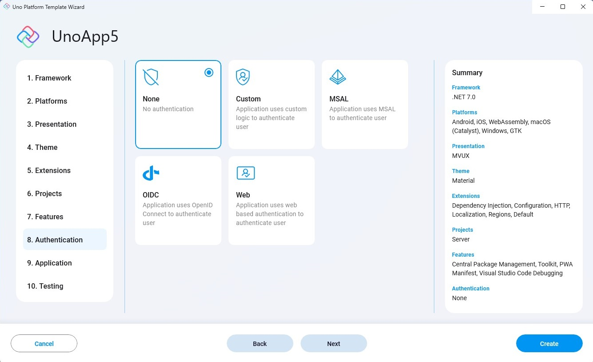

- **None**  
    Excludes authentication features from the generated projects.

- **Custom**  
    Adds Uno Platform's [Custom Authentication](xref:Learn.Tutorials.Authentication.HowToAuthentication) support to the generated project.

    Using Uno's authentication tools you can easily integrate in your app a login screen and authenticate users. It also helps you manage and track the state of the app's authentication, by allowing you to log out or switch users as well as other authentication-related actions.

    Uno.Extensions.Authentication currently supports these types of authentication:

    1. **Custom**: provides a customized login experience for performing login, refresh, or logout. This is also the authentication type that is generated with the project template when Custom Authentication is selected. The other types are not supported yet at the moment but they're on the roadmap and will come to the wizard soon.
    1. **MSAL**: [MSAL](https://github.com/AzureAD/microsoft-authentication-library-for-dotnet) (formerly AzureAD) stands for Microsoft Authentication Library, is part of the [Microsoft Identity Platform](https://learn.microsoft.com/en-gb/azure/active-directory/develop/v2-overview) and enables acquiring authentication tokens and access of protected APIs using OAuth2 and OpenID.
    1. **OIDC**: also referred to as [OpenID Connect](https://openid.net/connect), is a simple identity layer using the OAuth 2.0 protocol.
    1. **Web**: Web authentication is achieved via a web page that the app sends over to be opened in the browser and gets a token result once the login process is completed successfully.

    Read the [Authentication documentation](xref:Overview.Authentication) to get more knowledge about Uno Platform's authentication support and the tools it provides.

    > [!NOTE]    
    > The Authentication option is selected by default in the Default template, and not in the Blank one.
    > This option is dependent on the [DependencyInjection](#extensions) option and is only shown if the latter is enabled.

