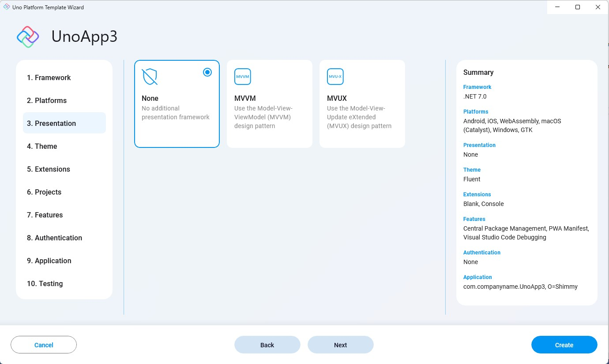

This setting allows you to choose a presentation architecture.

- #### None
    Generates a project without any presentation architecture installed.

- #### MVVM
    Generates a project optimized for use with the traditional MVVM architecture, using Microsoft's [MVVM Community Toolkit](https://learn.microsoft.com/en-us/dotnet/communitytoolkit/mvvm).

- #### MVUX
    The MVUX pattern is a new programming architecture by Uno Platform. It stands for ***M**odel **V**iew **U**pdate e**X**tended*.
    Its main feature is enabling the use of immutable [POCO](https://en.wikipedia.org/wiki/Plain_old_CLR_object) entities and Models (using [records](https://learn.microsoft.com/en-us/dotnet/csharp/whats-new/tutorials/records)) as the presentation layer, making the whole need for implementing property change notification redundant.
    This is achieved using Uno Platform's powerful code-generation engine to introduce proxy models that adapt the models to bindable proxy types that react upon changes in the UI side by recreating the Model.  
    It also introduces [Feeds](xref:Overview.Mvux.Feeds) and [States](xref:Overview.Mvux.States), two utilities that are used to maintain asynchronous data requests to the service, Feeds only keep the data as received from the service, while States are also used to store their current state according to updates made in the View. These two utilities wrap the data around with a metadata layer that discloses information about the current state of the request, whether it's still in progress, if an error occurred, if no data was returned, and also supports tracking data-selection and pagination as well as other features. These tools also support collection data using the [`ListFeed`](xref:Overview.Mvux.ListFeeds) and [`ListState`](xref:Overview.Mvux.ListStates).  
    On top of that, there is also the [`FeedView`](xref:Overview.Mvux.FeedView) control which is built to consume this metadata and adapts the View according to the current state of the Model.  
    The code-generation engine also makes it easier to write commands to be consumed by the View, see [Commands](xref:Overview.Mvux.Advanced.Commands).

    To learn more about the MVUX pattern, read [this](xref:Overview.Mvux.Overview).

