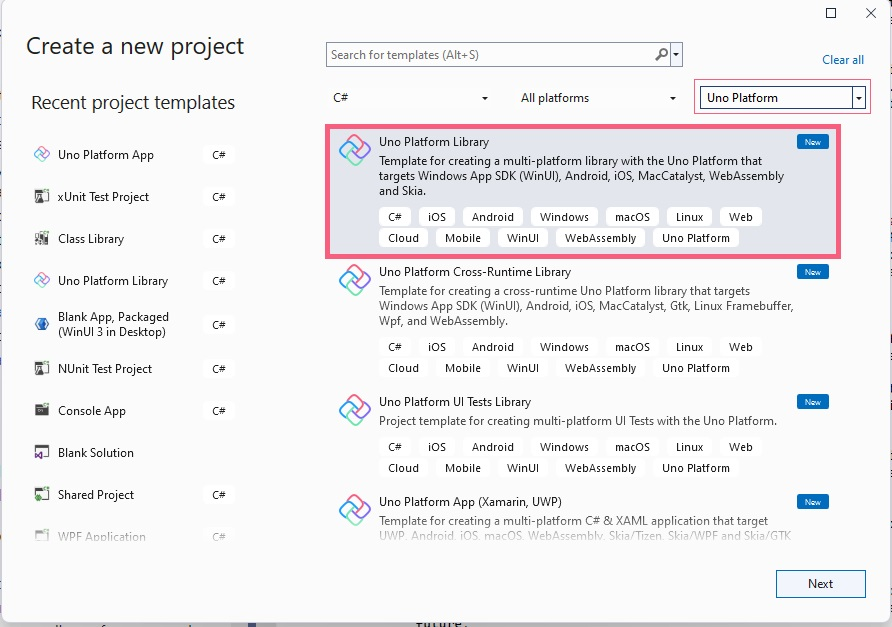

# Using the Project Template Wizard

## Getting started

The [Uno Platform Visual Studio extension](https://marketplace.visualstudio.com/items?itemName=unoplatform.uno-platform-addin-2022), provides project templates for the open source Uno Platform with which you can create single-source code, cross-platform solution and choose from the platforms to target: iOS, Android, WebAssembly, macOS, mac Catalyst, Windows and Linux.

After having installed the required workloads and the extension (use [Uno-Check](xref:UnoCheck.UsingUnoCheck) to verify that your environment is Uno Platform ready), search and click the Uno Platform App in your new project to open the wizard.

When prompted, configure the project and solution name and select the location to which the files should be saved, and click Create or hit <kbd>Enter</kbd>.

## Selecting startup type

[!INCLUDE [Startup](startup.md)]

## Project configuration wizard

Throughout the wizard you can configure the following options, but you can click *Create* at any time to complete the project generation.  
Clicking *Cancel* returns to the [main page](#selecting-startup-type).

1. [Framework](#framework)
1. [Platforms](#platforms)
1. [Presentation](#presentation)
1. [Markup](#markup)
1. [Themes](#themes)
1. [Extensions](#extensions)
1. [Projects](#projects)
1. [Features](#features)
1. [Authentication](#authentication)
1. [Application](#application)
1. [Testing](#testing)

<!-- do not delete this line - it ends previous list -->

1. ### Framework

    [!INCLUDE [Framework](frameword.md)]

1. ### Platforms

    [!INCLUDE [Platforms](platforms.md)]

1. ### Presentation

    [!INCLUDE [Presentation](presentation.md)]    

1. ### Markup

    [!INCLUDE [Markup](markup.md)]

1. ### Themes

    [!INCLUDE [Themes](themes.md)]

1. ### Extensions

    [!INCLUDE [Extensions](extensions.md)]

1. ### Projects

    [!INCLUDE [Projects](projects.md)]

1. ### Features

    [!INCLUDE [Features](features.md)]

1. ### Authentication

    [!INCLUDE [Authentication](authentication.md)]

1. ### Application

    [!INCLUDE [Application](application.md)]

1. ### Testing

    [!INCLUDE [Testing](testing.md)]
